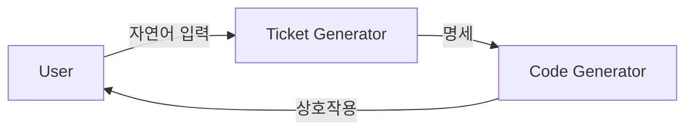
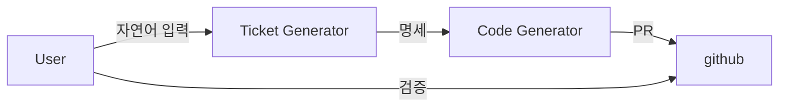
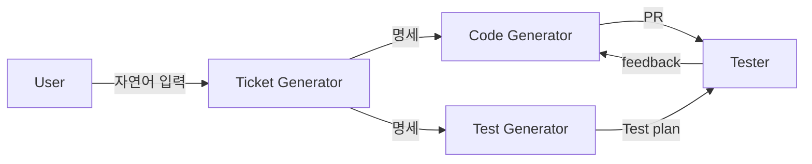

# 0. 들어가며

현재 팀은 두명으로 모바일 어플리케이션과 서버, 인프라를 모두 작업하고 있다. 따라서 개발 속도가 빠르지 못하여 릴리즈 주기가 점점 늘어지고 있다. 이대로 가다가는 스토어에서 철퇴를 맞을수도 있다.

다행히 시대가 바뀌었다. 더이상 코드를 생성하는 것은 사람만이 할 수 있는 작업이 아니다. 오히려 LLM이 이를 더욱 효과적으로 수행하고 있다.
그러나 기업은 더이상 이전처럼 사람을 구하지 않는다.

{: width="400" height = "400"}_비극일까_

구인난이 심화되었지만 동시에 개개인의 생산성도 매우 증가했다. 이는 현재 우리에게는 기회이다. 빠르게 변화하는 흐름에 탑승하여 적은 인원으로 최대의 효율을 내고자 한다. 엔터프라이즈급 자동화가 목표는 아니다. 우리는 툭툭 던지는 아이디어를 빠르게 개발하여 릴리즈 하는 것을 목표로 한다.

---

# 1. 계획 수립하기

앞서 [에이전트란 무엇인지](/posts/agent/)를 알아보았으니 이제 이를 시스템 내부에서 어떻게 적용할지 파악해야 한다.

## 1.1 기능 명세와 기능구현의 분리

우리가 만들고자 하는 시스템은 자연어인 사용자의 입력을 통해 코드 생성이 자동화되는 것이다. 이를 다시 나누자면
```
- 자연어인 사용자의 입력
- 코드생성 자동화
```

두 세부적인 기능으로 다시 나눌 수 있다.

사용자 요청은 자연어로 들어오며, 일정한 요청 템플릿을 사용하더라도 이를 그대로 코드 자동화 시스템 내부 입력으로 사용하는 것은 위험하다. 자연어는 표현 방식이 다양하고, 동일한 의도도 여러 방식으로 서술될 수 있기 때문이다. 자연어를 직접 코드 생성 시스템에 전달하면 해석의 불일치, 의도 왜곡, 잘못된 생성 결과로 이어질 가능성이 크다.

따라서 우리는 이를 구분하여 두가지 시스템을 설계할 것이다.

1. 사용자의 자연어 입력을 자동화 시스템에서 재사용 가능한 명세로 재구성한다.
2. 명세를 통해 코드 자동화를 수행한다.

이 두가지 시스템은 동일한 '**명세**'를 기준으로 동작하나 각 시스템의 구현에는 관심이 없다. 또한 **'명세'는 프로젝트 전체에서 공통적으로 식별 가능한 내부 표현**이어야 한다. 즉, 특정 저장소의 개별 문맥에만 의존하는 형태가 아니라, app, server, infra 등 시스템 전반에서 공통으로 참조할 수 있는 기준, 다시 말해 `source of truth`에 맞춘 구조여야 한다.

예를 들어 명세는 다음과 같은 단위로 정의될 수 있다.
```
- 도메인 단위의 변경 요청
- bounded context 단위의 기능 추가 또는 수정
- 프로젝트 공통 규약에 따른 작업 유형
- 저장소 간 책임 경계를 반영한 대상 식별
- 시스템 전반에서 공통으로 이해 가능한 변경 단위
```

## 1.2 Human In The Loop

시스템 설계 방향은 기본적으로 **`human-in-the-loop`** 방식에 기반한다.

[What is Human In The Loop with AI? How HITL Shapes AI Systems](https://www.youtube.com/watch?v=9iS-YYLIXiw)

>HITL은 인간의 개입 정도에 따라 스펙트럼으로 나뉩니다. 한쪽 끝에는 **'Human-in-the-loop'** 자체가 있는데, AI가 사람의 승인을 기다려야만 다음 단계로 진행됩니다. 이는 AI가 추천이나 하위 작업을 수행하지만, 최종 결정은 인간이 내리는 방식입니다

**`human-in-the-loop`**은 다음과 같은 방식으로 현재 시스템에 적용할 수 있을 것으로 보인다.

- **Confidence Thresholds**  
    시스템의 확신도가 일정 기준 이상일 때만 자동 진행  
    예: 대상 repo 판단 confidence가 0.9 이상이면 자동 진행, 아니면 사람 검토
- **Approval Gates**  
    확신도와 상관없이 반드시 사람 승인이 필요한 지점  
    예: PR 생성 전 승인, merge 전 승인, cross-repo issue 생성 전 승인
- **Escalation Queues**  
    자동 처리하기 애매하거나 위험한 작업을 따로 모아 검토하는 큐  
    예: 대상 repo가 불명확한 요청, 여러 repo에 영향 주는 변경, 테스트 반복 실패 건

## 1.3 계획

자동화 시스템을 한번에 구축할수 없기에 다음과 같이 phase를 나누어 시스템을 단계적으로 구축해 나갈 계획이다. '명세'가 생성되어 코드 생성으로 넘어갈 수 있는 시점을 `엔트리 포인트` 로 정의하겠다.

### **phase1** : 명세 생성의 자동화. 코드생성의 자동화



- **핵심:** 자연어 입력을 통한 코드 생성 엔트리 포인트 구축 및 로컬 기반 실행.
- **엔트리 포인트:** GitHub Issue를 시작으로, 향후 티켓이나 이벤트 등으로 확장 가능.
- **동작:** 로컬 PC에서 Claude Agent를 활용해 코드를 생성하며, 사용자와 상호작용 후 변경 사항을 저장소에 푸시하고 PR을 생성.
- **검토:** 생성된 PR은 사람이 직접 검토 및 수정.

명세생성은 자연어 기반의 입력이며 이후 Github issue로 반환된다. 이 단계에선 Issue 자체가 '명세'이며 코드 생성 자동화 시스템은 이를 기준으로 동작한다.
작업의 시작은 redis나 sqs 등을 통해 메시지 기반으로 트리거 될 수 있다.


### **phase2**. 사용자는 단일 지점에서만 검증



- **핵심:** 로컬 환경을 벗어나 컴퓨팅 인스턴스(Cloud 등) 기반의 자동화 구현.
- **동작:** 엔트리 포인트부터 PR 생성까지 전 과정을 인스턴스 위에서 자동 수행 후 자원 반환.
- **개입:** 사용자는 코드 생성 과정이 아닌, 완료 시점(PR)에서만 개입하여 머지 여부나 재수정 요청을 결정.

phase1과 흐름은 비슷하나 사용자의 개입을 줄이는 것을 목표로 한다.
사용자 상호작용은 pr 이후의 동작, 즉 코드생성 단위가 아닌 완료 시점 이후에 개입하는 것을 목표로 한다. LLM 에이전트간의 상호작용과 가드레일을 보다 명확하고 높은 수준으로 구현해야 한다.

→ 실제 구현 내용은 [바로 자동화 - Phase 2 구현하기](/posts/바로-자동화-Phase2-구현하기/)에서 이어진다.

### **phase3.** ci/cd + test의 자동화



- **핵심:** PR 이후 스테이징 환경 진입 및 테스트 에이전트 도입.
- **동작:** 테스트 생성 시스템이 엔트리포인트에서 병렬적으로 시작된다. 검증 시스템이 추가된다.
- **피드백:** 테스트 실패 시 실패 케이스를 코드 생성 에이전트에게 전달하여 통과할 때까지 수정 루프 반복.

PR 이후 특정 트리거를 통해 시스템은 스테이징 환경으로 진입한다. 이 스테이징 환경에서는 에이전트가 미리 정의한 테스트를 수행한다. 테스트는 엔트리 포인트 이후부터 준비될 수 있으며, 별도의 테스트 에이전트가 동일한 엔트리 포인트를 기준으로 테스트 계획과 스크립트를 작성하는 구조를 상정할 수 있다.

현재 테스트 유형은 아직 구체적으로 확정되지 않았지만, 예를 들면 다음과 같은 종류가 포함될 수 있다.

- Acceptance Test
- 부하 테스트
- 시나리오 기반 검증
- 회귀 테스트

이 시점에서 부터 자동화 시스템의 토큰 비용 관리와 작업 시간 관리, 모니터링이 필수적일 것이다.

### **phase4.** 완전한 자동화

- **핵심:** 사용자 개입 범위를 엔트리 포인트와 최종 승인 단계로 최소화.
- **동작:** App, Server, Infra 등 개별 저장소가 유기적으로 소통하며 전체 워크플로우를 완결.
- **안정성:** 완전 자동화의 위험성을 고려하여, 사람의 개입이 필요한 최적의 시점을 Phase 3 단계에서 도출 및 확정.

 완전 자동화는 아직 위험하다.  
에이전트의 동작은 본질적으로 예측 가능성이 낮고, 특히 여러 저장소가 연결되는 순간 영향 범위가 급격히 커질 수 있다. 따라서 이 실질적으로 달성해야 할 목표라기보다, 장기적인 지향점으로 볼 것이다.

또한 각 phase별 토큰에 따른 비용과 인프라 관리 비용이 비약적으로 증가할 수 있기에 phase전환은 구현 이후 어느정도 운영해보고 판단할 필요성이 있다.

{: width="400" height = "400"}_장밋빛 미래를 꿈꾸며_
