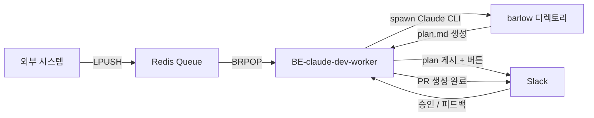
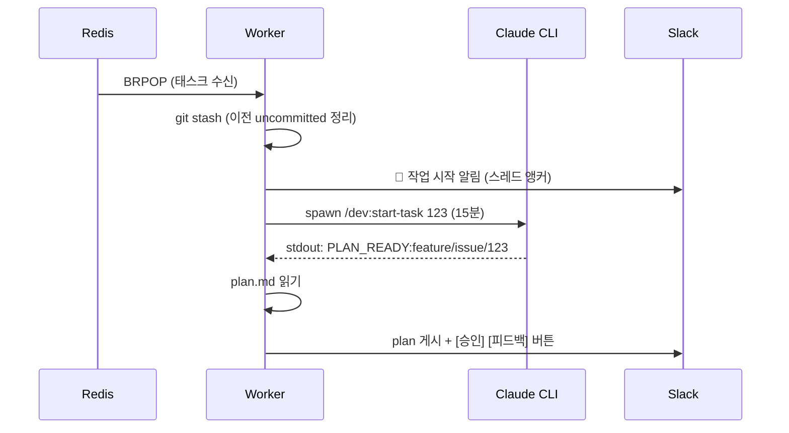
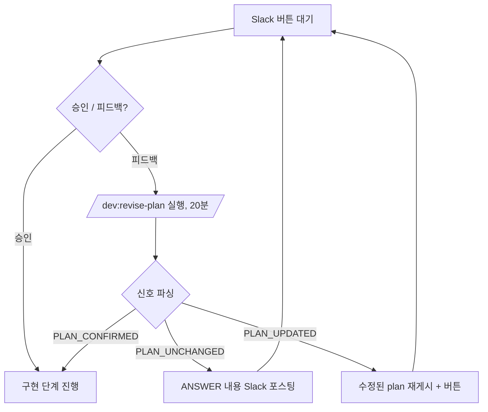
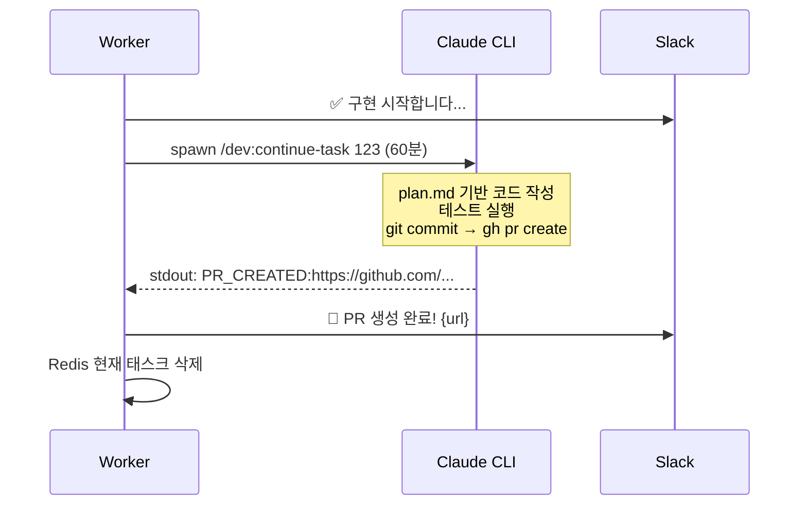

# 0. 들어가며

[지난 글](/posts/바로-자동화-계획하기/)에서 자동화 시스템의 설계 방향과 Phase별 로드맵을 정리했다. 요약하자면 자연어를 직접 코드 생성에 쓰는 것은 위험하며, `자연어 → 명세 → 코드`라는 이단 구조가 핵심이었다.

이번 글에서는 그 계획을 실제로 어떻게 구현했는지를 다룬다. Phase 1에서 Phase 2로 전환하는 오케스트레이터, **BE-claude-dev-worker**를 설계하고 만들면서 겪은 것들이다.

---

# 1. 현재 위치: Phase 1 → Phase 2

기존 로컬 워크플로우는 다음과 같았다.

```
개발자가 터미널에서 직접 claude --print '/dev:start-task 123' 실행
     → plan.md 생성 → 눈으로 확인 → claude --print '/dev:continue-task 123' 실행
```

이것이 Phase 1이다. 명세 기반 코드 자동화는 동작하지만, 개발자가 로컬에 붙어 있어야 하고 한 번에 하나의 이슈만 처리할 수 있다.

Phase 2의 목표는 이 과정을 클라우드 워커로 옮기고, 인간의 개입 지점을 **계획(plan.md) 승인 하나**로 줄이는 것이다.



---

# 2. 핵심 설계: 신호 계약

Worker가 Claude를 블랙박스 서브프로세스로 실행하고, stdout에서 특정 패턴만 파싱하는 방식을 선택했다.

Claude 명령이 stdout으로 아래 신호를 출력하면 Worker가 다음 단계로 진행한다.

```
PLAN_READY:{branch}      → 계획 생성 완료, Slack에 plan.md 게시
PLAN_UPDATED             → 피드백 반영 완료, 수정된 plan 재게시
PLAN_UNCHANGED           → 질문에 대한 답변만 (계획 변경 없음)
PLAN_CONFIRMED:{branch}  → 수정 + 즉시 확정, 구현 단계로 진행
ANSWER:{text}            → Claude 답변 내용
PR_CREATED:{url}         → PR 생성 완료
```

이 계약이 두 프로젝트의 통합 인터페이스다. Barlow의 Claude 명령들이 이 신호를 출력하지 않으면 Worker는 멈춘다.

---

# 3. 전체 워크플로우

## 3.1 태스크 수신부터 계획 승인까지



## 3.2 승인 루프

피드백이 들어오면 Claude를 다시 실행해 plan.md를 수정한다. 승인이 날 때까지 반복된다.



## 3.3 구현 및 PR 생성



---

# 4. .workspace 디렉토리의 역할

Worker와 Claude 사이의 공유 상태는 파일로 관리된다.

```
barlow/.workspace/
├── routing.md       # BC 결정, 브랜치 타입, 이슈 요약
├── scope.md         # 영향 파일, 함수명, 코드 분석 결과
├── rules-applied.md # 아키텍처 규칙 적용 결과
└── plan.md          # 최종 구현 계획 (Worker ↔ Claude 공유)
```

`plan.md`가 핵심이다. Worker는 이 파일을 읽어 Slack에 게시하고, Claude는 이 파일을 수정하며 계획을 발전시킨다. 인간도 Slack을 통해 이 파일의 내용을 보고 승인 여부를 결정한다.

---

# 5. 안정성 설계

자동화 시스템에서 크래시는 피할 수 없다. 다음과 같이 대응한다.

| 상황 | 처리 방식 |
|---|---|
| Uncommitted changes 존재 | git stash로 정리 후 진행 |
| PLAN_READY 신호 미수신 | Slack 알림 후 태스크 종료 |
| plan.md 10초 내 미생성 | 예외 발생 → 태스크 정리 |
| Claude 프로세스 타임아웃 | SIGTERM으로 서브프로세스 종료 |
| Worker 프로세스 크래시 | PM2 자동 재시작 + 시작 시 abandoned task 알림 |

Redis에 현재 태스크를 TTL 48h로 저장해두기 때문에 Worker가 재시작되더라도 중단된 작업을 추적할 수 있다.

---

# 6. 현재 위치와 다음 과제

현재 시스템은 Phase 2까지 완성된 상태다.

| Phase | 상태 | 설명 |
|---|---|---|
| Phase 1 | ✅ 완료 | 로컬 CLI 기반 명세 → 코드 자동화 |
| Phase 2 | ✅ 완료 | Redis 큐 + Slack Human-in-the-Loop + PM2 상시 대기 |
| Phase 3 | 미구현 | 테스트 에이전트 통합 + 실패 시 피드백 루프 |

Phase 3으로 가기 위해서는 구현 단계에도 피드백 루프가 필요하다. 현재는 승인 루프가 계획 단계에만 존재한다. 구현 중 테스트가 실패했을 때 이를 Worker가 감지하고 Claude에게 재시도를 지시하는 구조가 추가되어야 한다.

구체적으로는 `TEST_FAILED:{reason}` 같은 신호를 `/dev:continue-task` 명령에서 출력하도록 확장하고, Worker의 오케스트레이션 로직에 구현 단계 재시도 루프를 추가하는 작업이다.

완전 자동화는 아직 위험하다. Phase 3까지 운영해보며 인간이 어느 지점에서 개입해야 하는지 데이터를 쌓아가는 것이 지금 단계에서 할 수 있는 가장 현실적인 접근이다.