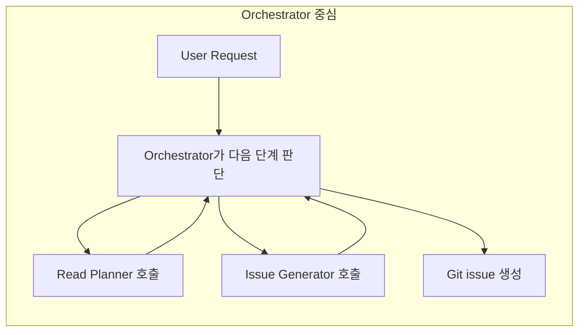
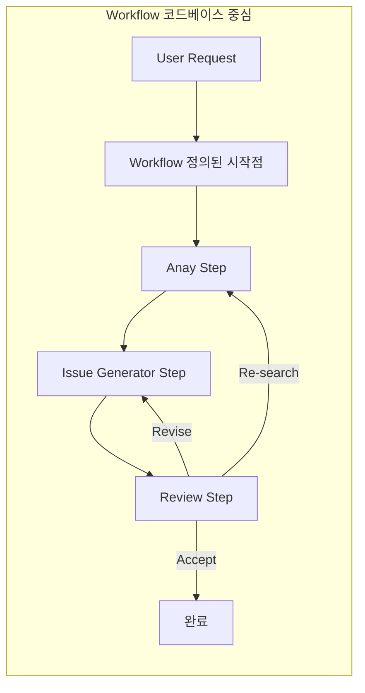
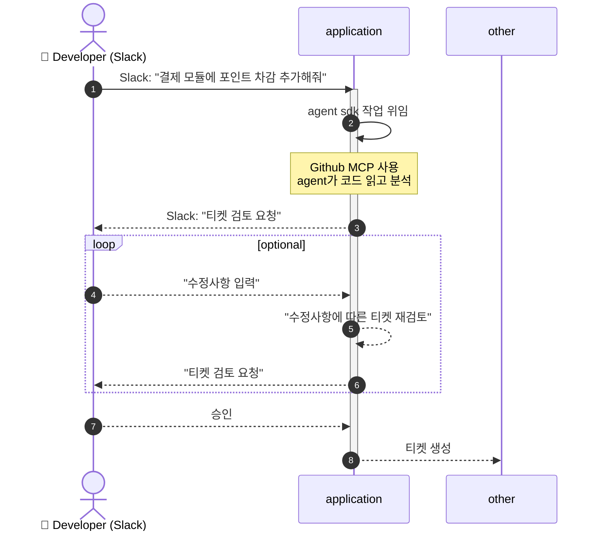
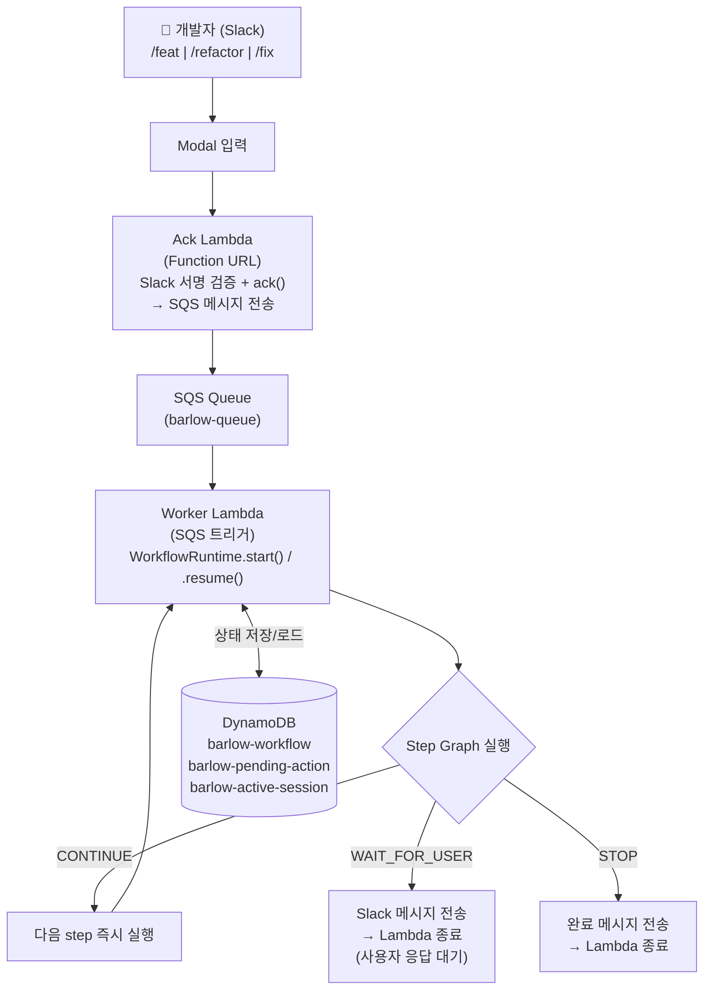

## 1. 목표

**이 시스템의 목표는 사용자의 자연어 입력을 구조화된 기능 명세서로 변환하는 것이다.**

시스템은 **Slack을 Approval Gate로 사용하는 human-in-the-loop 방식**을 전제로 한다.   따라서 기능 명세 자동화 시스템은 처음부터 **Slack 친화적인 상호작용 구조**를 갖추어야 한다.

즉, 다음 조건을 만족해야 한다.

- 자연어 요청을 입력으로 받는다.
- 코드와 문서를 분석해 기능 명세 초안을 생성한다.
- Slack에서 사용자가 검토·수정·승인할 수 있어야 한다.
- 승인 이전에는 다음 단계로 넘어가지 않도록 통제되어야 한다.

## 2. 시스템 추상화

**에이전트를 전체 시스템의 주체가 아니라, workflow 내부의 실행 단위로 제한하도록 구성하였다.**

앞서 보았듯이 ‘에이전트’라는 개념은 매우 넓고 모호하다.  
어떤 경우에는 전체 작업을 자율적으로 수행하는 orchestrator를 의미하고,  
어떤 경우에는 특정 단계에서만 호출되는 LLM 기반 작업 단위를 의미한다.

본 시스템에서 Agent는 **LLM을 기반으로 자율적으로 도구(Tool)를 호출하며, LLM을 활용해 작업을 수행하는 최소 기능 단위**로 정의하고 사용할 것이다.

에이전트에게 어디까지 자율성을 부여할지에 대해서는 다음과 같이 판단한다.

- 사용자 승인 여부와 step 간 전이는 **코드가 결정**해야 한다.
- 에이전트는 **각 step 내부에서 필요한 추론과 생성 작업만 수행**해야 한다.
- 전체 흐름을 에이전트에게 위임하는 방식은 human-in-the-loop 보장과 비용 측면에서 불리하다.

### 2.1 Agent as Orchstrator?
**에이전트가 전체 workflow를 직접 오케스트레이션하는 방식은 적절하지 않다.**


이 경우 에이전트는 다음 단계를 스스로 판단하고, 필요한 tool을 호출하며, 최종적으로 GitHub issue 생성까지 이어지는 흐름을 주도하게 된다.
겉으로 보기에는 유연하고 강력해 보이지만, 실제 시스템 설계 관점에서는 명확한 한계가 있다.

**문제점 1. Human-in-the-loop를 보장하기 어렵다**

가장 큰 문제는 **사용자 승인 절차를 결정적으로 강제하기 어렵다는 점**이다.  
아무리 강한 가드레일과 tool 사용 지침을 주더라도, 에이전트가 이를 회피 가능하다.
결국 human-in-the-loop을 프롬프트로 “유도”할 수는 있어도, **시스템 차원에서 보장하려면 deterministic한 제어 로직이 필요하다.**

**문제점 2. 비용의 증가**

전체 workflow를 에이전트에게 맡기면, 각 단계 판단과 내부 function call 자체가 모두 토큰 비용이 된다.  
호출이 반복될수록 내부 컨텍스트가 계속 누적되고, 그에 따라 비용도 함께 증가한다.

아래의 기능들은 LLM을 통해 추론해야 하는 고차원적인 기능들이 아니다.
- step 간 전이
- 승인 대기
- 재검토 요청 처리
- 재탐색 여부 결정

이러한 흐름은 충분히 **코드로 명시할 수 있는 절차적 로직**이며 시스템 내부에서 결정적으로 동작해야 한다.

### 2.2 Agent as Step
**따라서 본 시스템은 에이전트를 workflow 내부의 step 실행 단위로 사용하는 구조를 채택한다.**

이 구조에서는 전체 작업이 **workflow와 step**으로 먼저 정의된다.  
그리고 LLM agent는 각 step 내부에서만 호출된다.

- **step 간 전이**는 코드가 제어하고
- **사용자와의 상호작용**도 코드가 관리하며
- **에이전트는 각 step에서 필요한 분석·생성 작업만 수행**한다

이렇게 역할을 분리하면 human-in-the-loop을 안정적으로 구현할 수 있다.

**장점 1. Approval Gate를 결정적으로 보장할 수 있다**

Slack 검토와 승인 절차를 workflow의 일부로 명시하면,  
승인 이전에 issue 생성 단계로 넘어가지 않도록 **코드로 강제**할 수 있다.

**장점 2. 시스템 책임이 명확해진다**

- **Workflow 코드**: 상태 전이, 승인 대기, 재실행 분기 제어
- **LLM agent**: 분석, 읽기, 생성 등 step 내부 작업 수행
- **Slack**: 사용자 검토 및 승인 인터페이스

이렇게 되면 에이전트의 비결정성을 시스템을 통해 흡수하는 형태가 되어,  
전체 동작을 더 예측 가능하게 만들 수 있다.

**장점 3. 비용과 복잡도를 줄일 수 있다**

에이전트는 각 step 내부에서 필요한 만큼만 호출되므로,  
전체 workflow를 한 번의 긴 컨텍스트로 끌고 가는 방식보다 비용 관리가 쉽다.

또한 **디버깅 관점에서도 훨씬 유리**하다.  
문제가 발생했을 때 “workflow 전이 문제인지”, “step 내부 agent 출력 문제인지”를 분리해서 볼 수 있기 때문이다.

### 2.3 구체화

실제 동작 흐름은 ‘애플리케이션이 workflow를 제어하고, 에이전트는 내부 작업을 수행하며, Slack은 검토·승인 인터페이스로 작동하는 형태’로 구체화할 수 있다.



**Slack을 명시적인 Approval Gate**로 사용하여 **Human-in-the-loop**를 보장한다.

사용자가 Slack에서 요청을 입력하면, 애플리케이션은 workflow를 시작하고 내부적으로 에이전트 작업을 수행한다. 이때 에이전트는 GitHub MCP 등을 활용해 관련 코드와 문서를 읽고 분석할 수 있다.

이후 시스템은 생성된 기능 명세 초안을 Slack으로 전달하고, 사용자에게 검토를 요청한다.  
사용자는 이 초안을 보고 수정사항을 남기거나, 최종 승인할 수 있다.

## 3. Implementing Agent

**본 시스템은 자연어 요청을 바로 이슈로 생성하지 않고, 연관 도메인 판별과 유사 이슈 검토, 사람의 승인 절차를 거친 뒤 명세를 구체화하는 방식으로 동작한다.**

명세 생성 흐름은 다음과 같다.

0. 사용자 입력
1. source of truth를 기반으로 연관 작업 판별 (AI)
2. 1의 결과를 바탕으로 유사 이슈 판별 (AI)
3. Approval Gate (사람)
4. 2의 결과를 바탕으로 명세 구체화 (AI)
5. Human Approval (사람)
6. 이슈 생성 (시스템)
7. 이후 후속 동작 수행 (시스템)

이 일련의 작업은 모두 시스템 내부 workflow로 정의되며,**단계 간 전이와 실행 여부는 코드가 통제한다.**  
LLM 에이전트는 각 단계에서 필요한 판단과 생성 작업만 수행하며,**전체 흐름을 직접 제어하지 않는다.**

또한 에이전트의 출력과 사용자 피드백, 승인 이력 등 **하나의 workflow에 관한 컨텍스트는 시스템이 직접 관리한다.**

시스템의 기본 원칙은 다음과 같이 정리한다.

- workflow는 시스템이 통제한다.
- 에이전트는 step 내부에서만 동작한다.
- 사용자 승인은 반드시 코드 수준에서 보장한다.
- workflow 컨텍스트는 시스템이 관리한다.

### 3.1 프롬프트 설정

**Source of Truth로써의 Encyclopedia**

사용자가 자연어로 기능 추가 요청을 보낸다고 가정하자.  
시스템은 먼저 LLM 에이전트를 통해 해당 요청과 관련 있는 요소를 파악하고 평가한다.
이후 에이전트에게 작업을 위임할 때, **어떤 범위(scope)에서 작업을 시작해야 하는지 정의하는 출발점**을 만드는 작업이 필요하다.

초기 방식에서는 Git remote MCP의 `get_repository_tree`를 활용해 관련 항목을 탐색했다.

예시
```json
{
  "requestSummary": "사용자 요청 요약",
  ...
  "candidates": [
    {
      "priority": "high",
      "path": "github.com/org/repo/some/path",
      "confidence": 0.9,
      "reason": "왜 이 경로가 관련 있다고 판단했는지"
    },
    {
      "priority": "medium",
      "path": "github.com/org/repo/uncertain/path",
      "confidence": 0.6,
      "reason": "왜 이 경로가 관련 있다고 판단했는지"
    }
  ]
  ...
}
```

해당 방식의 문제점은 다음과 같았다.


**문제 1. repository tree를 직접 탐색하는 방식은 너무 많은 토큰을 소모한다.**

예를 들어 Java 프로젝트의 기본 경로는 보통 다음과 같다.
```
src/main/java/com/org/...
```

멀티 모듈 구조라면 여기서 모듈 단위 depth가 더 늘어난다.  
이 상태에서 `get_repository_tree`를 사용할 경우 다음과 같은 문제가 발생한다.

- `recursive=false`이면 `src/main` 수준까지만 탐색되는 경우가 많다.
- `recursive=true`이면 레포지토리 전체 트리를 읽어버릴 수 있다.

즉, shallow하게 읽으면 정보가 부족하고, deep하게 읽으면 비용이 지나치게 커진다.

실제로 candidate path도 일정한 depth로 출력되지 않았다.

- 어떤 경우에는 `src/main/java/com/barlow/core/` 수준에서 멈추고
- 어떤 경우에는 `src/main/java/com/barlow/core/domain/.../SomeClass.java`까지 내려간다

이를 프롬프트로 더 강하게 제한할 수 있으나 조건이 늘어날수록 프롬프트는 길어지고, 에이전트에게 **일관된 방식으로 동작할 것을 강제하기가 더 어려워진다.**

탐색 시작점을 프롬프트에 hint를 통해 제공하는 방식은 다음의 관리상 문제를 야기하므로 근본적인 해결책이 아니라고 판단한다.

- **에이전트 자율성 저하**: 에이전트가 부여된 힌트에 과적합(Overfitting)되어 오히려 자율적인 판단 능력이 제한되는 현상이 발생한다.
- **경로 관리 복잡성**: 참조할 모듈의 경로를 지속적으로 추적하고 프롬프트에 반영(업데이트)해야 하는 운영 부담이 따른다.
- **설정 정보 파편화**: 비정형 텍스트(프롬프트)에 의존하여 관리할 경우 시스템 유지보수성이 크게 저하되며 시스템 레벨에서 이를 관찰할 수 없음.

---

**문제 2. 구현 수준에 지나치게 가깝다**

**현재 필요한 것은 코드 구현 수준의 세부적인 탐색이 아니라, 명세 수준의 추상화다.**

repository tree를 직접 읽히면 “어느 파일을 수정해야 하는가”를 추론하는 데는 분명 도움이 된다.  

하지만 지금 이 단계에서 필요한 것은 파일 단위 수정 계획이 아니라, **무엇을 어떤 도메인 관점에서 정의해야 하는가**에 대한 명세 수준의 판단이다.

따라서 에이전트는 다음의 질문에 답해야 한다.

- 어떤 bounded context와 관련된 요청인지
- 기존 도메인 안에서 해결 가능한지
- 새로운 bounded context가 필요한지
- 어떤 수준에서 명세를 구체화해야 하는지

이 질문들은 구현 세부보다 **도메인 추상화**에 가깝다.


**Source of Truth로서의 Encyclopedia**

이 문제를 해결하기 위해, repository의 `ENCYCLOPEDIA.md`를 source of truth로 사용하기로 했다.

`ENCYCLOPEDIA.md`는 서비스 내에서 사용되는 bounded context를 정의한 문서이며, 프로젝트 전체에서 에이전트들이 작업을 판단할 때 참조하는 **단일 기준점(single source of truth)** 이다.

이 방식을 사용하면 다음과 같은 장점이 있다.

- 요청을 bounded context 단위로 정규화할 수 있다
- 명세를 구현 경로가 아니라 도메인 단위로 생성할 수 있다
- 토큰 비용을 크게 줄일 수 있다
- 이후 단계에서 feature, rule, constraint를 더 자연스럽게 연결할 수 있다

예를 들어 `"회원가입 기능 추가"` 와 같은 모호한 입력이 들어오더라도, 이를 서비스가 사용하는 bounded context 단위로 해석할 수 있다.

즉, 사용자의 자연어 입력을 그대로 처리하는 것이 아니라,  
**bounded context 중심으로 한 번 정규화한 뒤 다음 단계로 넘기는 구조**가 된다.

따라서 실제 repository tree를 광범위하게 읽히는 방식은 지양하고,  
먼저 연관 파일이나 디렉토리를 찾는 대신 **연관 bounded context를 탐색하는 구조**로 전환했다.

또한 이 구조에서는, 기존 bounded context로 설명되지 않는 요청이 들어왔을 때  
**새로운 bounded context를 추가해야 하는지 여부도 판단할 수 있다.**  
다만 이 판단은 도메인 구조에 영향을 미치는 만큼, 최종적으로는 사용자 승인 절차를 거쳐야 한다.

예시 응답은 다음과 같다.
```json
{  
  "requestSummary": "사용자 요청 요약",  
  "relevantBC": [  
    {  
      "bounded_context": "Account BC",  
      "confidence": 0.9,  
      "reason": "판단 이유"  
    },  
    {  
      "bounded_context": "Post BC",  
      "confidence": 0.6,  
      "reason": "판단 이유"  
    }  
  ]  
}
```

**명세 구조화**

**명세는 자유 서술형 텍스트가 아니라, 일정한 템플릿 구조로 관리될 수 있어야 한다.**

예를 들어 다음과 같은 형태를 생각할 수 있다.

```json
{  
  "issue_type": "feat",  
  "summary": "summary",  
  "goal": [  
    {  
      "type": "feature",  
      "description": "설명"  
    },  
    {  
      "type": "constraint",  
      "description": "제약사항"  
    },  
    {  
      "type": "domainRule",  
      "description": "도메인 규칙"  
    }  
  ]  
}
```

이처럼 구조화된 템플릿을 사용하면,  
명세 생성 결과를 이후 단계에서 재사용하거나 검토하기가 쉬워진다.

다만 실제로는 몇 가지 설계 판단이 더 필요하다.

- `description`을 어떤 수준의 추상도로 출력할 것인지
- `feature`를 어떤 기준으로 추출할 것인지
- `usecase`와 `feature`를 어떻게 구분할 것인지
- 팀 내부 문서 스타일과 어떻게 맞출 것인지

현재는 다음과 같이 구분하는 방향을 생각하고 있다.

- **usecase**: 사용자 중심의 흐름 -  “사용자가 무엇을 하려는가”
- **feature**: 시스템이 제공하는 기능 중심 단위 - “시스템이 어떤 기능을 제공해야 하는가”

또한 feature는 가능한 한 **재사용 가능한 기능 단위**로 출력하도록 유도하고 있다.  
다만 실제로 어떤 수준까지 feature를 쪼개고, 어떤 항목을 domain rule이나 constraint로 분리할지는 내부 합의와 성능 실험이 추가로 필요하다.

### 3.2 Agent SDK?

**시스템은 가능하면 model-agnostic하게 설계되어야 하며, 현재는 현실적인 이유로 OpenAI Agents SDK를 사용하고 있다.**

“왜 OpenAI를 선택했는가”보다 왜 Claude Agent SDK를 기본 선택지로 두지 않았는지 설명하겠다.

### Claude를 기본 선택지로 두지 않은 이유

현재 Claude Agent SDK는 범용 에이전트 SDK라기보다는 **Claude CLI의 wrapper에 가까운 수준이다**. 내부적으로는 Claude CLI가 실행되고, SDK는 이를 `stdio` 기반으로 감싸는 방식에 가깝다.
이런 구조에도 장점이 있을 수 있지만 우리가 고려하는 환경에서는 몇 가지 한계가 더 크게 보였다.

**1. 비용 문제**

Anthropic 모델 라인업은 주로 Haiku, Sonnet, Opus로 나뉘는데,  현재 기준에서는 비용 측면에서 OpenAI 대비 매력이 크지 않다고 판단했다.  만약 그 차이를 감수할 만큼 성능 우위가 분명하다면 선택 근거가 생기겠지만 강력한 코딩 도구가 필요한게 아니라 Encyclopedia.md를 기준으로 문맥 파악 및 추론만 하면 되서 조금 더 싼 모델에 대한 선택지를 열어놓기로 했다.

**2. 패키지 크기와 실행 환경 문제**

Claude Agent SDK는  패키지 크기가 비교적 큰 편이다. 람다 실행 환경 기준 50mb보다 크면 여러 귀찮은 일이 발생한다. 배포와 cold start 측면에서도 불리할 수 있다.
즉 서버리스 환경에서 사용하기에는 많이 무거운 녀석.

### Google ADK에 대해서

Google의 Gemini 및 Google Agent ADK는 아직 본격적으로 사용해보지는 않았다. 특히 Google ADK는 단순 SDK라기보다는 프레임워크에 가까운데 현재로서는 이를 도입할 시간이 조금 부족하다고 판단했다. 모델 호출 비용과 성능 면에서 보았을때 "과연 현재 시스템을 변경할정도인가?" 라고 생각했을때 잘 모르겠다.

## 4. Implementing System

시스템은 **AWS Lambda 기반 서버리스**로 구현되어 있다. 호출 빈도가 낮아 비용 최적화에 유리하고, 사용자와의 모든 상호작용은 **Slack**을 통해 이루어진다.

{: width="400" height = "400"}_구성_

---

### 4.1 전체 흐름 

Slack에서 `/feat` 명령어를 입력하는 순간부터 GitHub 이슈가 생성되기까지의 흐름이다.



사용자가 Slack 버튼을 클릭하면 Ack Lambda가 SQS에 resume 이벤트를 보내고, Worker Lambda가 이를 받아 이전 상태를 불러와 다음 단계를 이어 실행한다.

---

### 4.2 서버리스 구조적 제약

**Slack 3초 제한**

- 이벤트 전송 후 3초 내 응답 없으면 Slack이 실패로 간주 → 동일 이벤트 재전송
- AI 분석·GitHub API 호출은 수십 초~수 분 소요 → 3초 내 처리 불가
- Lambda는 `return` 즉시 freeze → 백그라운드 처리 불가

**해결: Lambda 분리 + SQS**

| | Ack Lambda | Worker Lambda |
|---|---|---|
| 제한 시간 | 3초 | 최대 900초 |
| 역할 | Slack 응답, modal 열기, SQS 전송 | AI 분석, GitHub API, workflow 실행 |

**제약: 완전한 Producer-Consumer 불가**

- Slack `trigger_id`는 발급 후 3초 만료 → modal 열기는 반드시 Ack Lambda에서 직접 처리
- Ack Lambda = 순수 Producer가 아닌 **Controller** 역할에 가까움


Slack봇의 동작을 서버리환경에서 실행하려 하니 시스템의 복잡도가 증가함.

| 소켓모드라면?      | 서버리스                      |
| ------------ | ------------------------- |
| 메모리에 상태 저장   | DynamoDB                  |
| 백그라운드 작업 유지  | SQS + Worker Lambda       |
| 대화 흐름(세션) 유지 | RESUME_MAP + Step Graph   |
| 사람 승인 대기     | WAIT 상태로 Lambda 종료 후 재트리거 |

---

### 4.3 상태 관리

workflow는 여러 단계에 걸쳐 진행된다.

```
BC 탐색 → 유사 이슈 확인 → 사용자 검토 → 명세 생성 → 사용자 승인 → 이슈 생성
```

다음에 어떤 단계를 실행할지는 SQS 메시지의 `event_type`과 `RESUME_MAP`이 결정한다. DynamoDB는 "다음 단계 결정"이 아니라 현재까지 작업에 대한 기록을 담당한다.

```python
RESUME_MAP = {
    "accept":          "create_github_issue",   # 승인 → 이슈 생성
    "extend_existing": "generate_issue_draft",  # 수정 요청 → 초안 재생성
    ...
}
```

**워크플로우가 저장하는 데이터 구조 (WorkflowInstance)**

각 워크플로우 실행 단위는 다음 정보를 DynamoDB에 저장한다.

| 필드                                   | 내용                                                           |
| ------------------------------------ | ------------------------------------------------------------ |
| `workflow_id`                        | UUID (고유 식별자)                                                |
| `workflow_type`                      | feat_issue / refactor_issue / fix_issue                      |
| `status`                             | CREATED / RUNNING / WAITING / FAILED / COMPLETED / CANCELLED |
| `current_step`                       | 현재 실행 중인 step 이름                                             |
| `state`                              | 각 step의 중간 결과들 (BC 목록, 이슈 초안 등)                              |
| `pending_action_token`               | WAITING 상태일 때 발급되는 UUID                                      |
| `slack_channel_id` / `slack_user_id` | 요청을 보낸 Slack 정보                                              |
| `ttl`                                | 24시간 후 자동 삭제                                                 |

**state 안에 담기는 실제 데이터 (FeatIssueWorkflowState)**
- 워크플로우 수명주기에서 사용하는 데이터들의 모음
- 하나의 스텝이 실행되면 필드가 업데이트
- nullable

| 필드 | 내용 |
|---|---|
| `user_message` | 원본 사용자 요청 |
| `bc_candidates` | BC 탐색 결과 |
| `relevant_issues` | 유사 이슈 목록 |
| `issue_decision` | 사용자가 선택한 처리 방향 |
| `issue_draft` | 생성된 명세 초안 |
| `github_issue_url` | 최종 생성된 이슈 URL |
| `user_feedback` | 수정 요청 시 사용자 피드백 |

```
워크플로우 시작 → user_message만 채워진 채로 생성
    ↓
step 실행 → apply_output이 해당 필드 채움
    ↓
DynamoDB 저장 → 누적된 state 전체 스냅샷
    ↓
다음 Lambda 실행 → 전체 복원 → extract_input이 필요한 것만 꺼냄
```

---

### 4.4 같은 작업이 두 번 실행되는 문제 — Dedup

Lambda cold start(2~3초)로 인해 Ack Lambda가 3초를 넘기면 Slack이 같은 이벤트를 다시 보낸다. 그러면 SQS에 같은 메시지가 두 개 들어가고, Worker Lambda가 같은 workflow를 두 번 실행하게 된다.

이를 막기 위해 두 가지 중복 방지 장치를 사용한다.

| 이름               | 기준 키        | 유효 시간 | 역할                               |
| ---------------- | ----------- | ----- | -------------------------------- |
| `pending-action` | 이벤트 고유 ID   | 1시간   | Slack 재전송, SQS 중복, 버튼 중복 클릭 차단   |
| `active-session` | 채널 + 사용자 ID | 24시간  | 같은 사람이 같은 채널에서 workflow 중복 시작 차단 |

Worker가 실행되기 직전에 DynamoDB에 "이미 처리 중"이라는 표시를 남기고, 같은 ID가 이미 있으면 실행을 건너뛴다. (`attribute_not_exists(pk)` 조건부 PutItem)

`active-session`은 워크플로우가 완료(COMPLETED), 실패(FAILED), 취소(CANCELLED)될 때 자동 해제된다. `/drop` 명령어나 `issue_drop` 버튼으로 강제 중단도 가능하다.

---

### 4.5 워크플로우 상세 — Step 그래프

feat 워크플로우(`feat_issue`)의 Step 실행 흐름이다.

```
find_relevant_bc          [CONTINUE]
    ↓
find_relevant_issue       [CONTINUE]
    ↓
wait_issue_decision       [WAIT_FOR_USER]
    ├─ reject_duplicate   → reject_end            [STOP]
    ├─ extend_existing    → generate_issue_draft
    ├─ block_existing     → generate_issue_draft
    └─ create_new_independent → generate_issue_draft
    ↓
generate_issue_draft      [CONTINUE]
    ↓
wait_confirmation         [WAIT_FOR_USER]
    ├─ accept             → create_github_issue   [STOP]
    ├─ reject             → regenerate_issue_draft
    └─ drop_restart       → regenerate_issue_draft
    ↓
regenerate_issue_draft    [CONTINUE]
    ↓
wait_confirmation         (루프)
```

각 step은 세 가지 신호(ControlSignal) 중 하나를 반환한다.

- **CONTINUE**: 바로 다음 step으로 넘어간다
- **WAIT_FOR_USER**: Slack 메시지를 보내고 Lambda를 종료한다. 사용자가 버튼을 클릭하면 재개된다
- **STOP**: 마지막 메시지를 보내고 워크플로우를 종료한다

**각 Step의 입출력**

| Step | 입력 | 출력 |
|---|---|---|
| `find_relevant_bc` | 사용자 메시지 | BC 후보 목록 |
| `find_relevant_issue` | 사용자 메시지 + BC 목록 | 유사 이슈 목록 |
| `wait_issue_decision` | 유사 이슈 목록 | Slack 버튼 UI |
| `generate_issue_draft` | BC 목록 + 처리 방향 | 명세 초안 (FeatTemplate) |
| `regenerate_issue_draft` | BC 목록 + 기존 초안 + 피드백 | 수정된 명세 초안 |
| `wait_confirmation` | 명세 초안 | Slack 버튼 UI |
| `reject_end` | 유사 이슈 목록 | 종료 메시지 |
| `create_github_issue` | 명세 초안 + 처리 방향 + 유사 이슈 | GitHub 이슈 URL |

**처리 방향(issue_decision)에 따른 GitHub 관계 설정**

유사 이슈가 있을 경우, 사용자가 선택한 방향에 따라 이슈 간 관계가 달라진다.

| Decision | 동작 |
|---|---|
| `extend_existing` | 기존 이슈의 하위 이슈로 생성 |
| `block_existing` | 기존 이슈가 새 이슈에 의해 block됨 |
| `create_new_independent` | 독립 이슈로 생성 (관계 없음) |
| `reject_duplicate` | 이슈 생성 안 함 (중복으로 판단) |

---

### 4.6 Lambda 간 통신 — SQS 이벤트 스키마

Ack Lambda와 Worker Lambda는 SQS 메시지로 통신한다. 메시지 형식은 두 가지다.

**새 워크플로우 시작 (pipeline_start)**

```json
{
  "type": "pipeline_start",
  "subcommand": "feat | refactor | fix",
  "channel_id": "C12345",
  "user_id": "U12345",
  "user_message": "결제 모듈에 포인트 차감 추가해줘",
  "dedup_id": "view_id"
}
```

**사용자 액션 후 재개 (resume)**

```json
{
  "type": "accept | reject | extend_existing | ...",
  "workflow_id": "uuid",
  "channel_id": "C12345",
  "user_id": "U12345",
  "additional_requirements": "...",
  "dedup_id": "action_ts"
}
```

---

### 4.7 이슈 템플릿

생성된 명세는 `FeatTemplate`이라는 구조화된 형태로 저장되며, 이 데이터를 기반으로 GitHub 이슈가 만들어진다.

| 필드 | 내용 |
|---|---|
| `issue_title` | 이슈 제목 |
| `about` | 개요 |
| `goal` | 목표 |
| `new_features` | 새로운 기능 목록 |
| `domain_rules` | 도메인 규칙 목록 |
| `additional_info` | 추가사항 |

GitHub에 생성될 때는 `title`, `body`, `labels: ["feat"]`, `type: "Feature"`로 전달된다.

워크플로우 종류에 따라 이슈 타입이 달라진다.

| 워크플로우 | GitHub type |
|---|---|
| `feat_issue` | Feature |
| `refactor_issue` | Refactor |
| `fix_issue` | Bug |

세부내용은 [저장소](https://github.com/ogongchill/barlow-automation)를 직접 참고하면 된다.